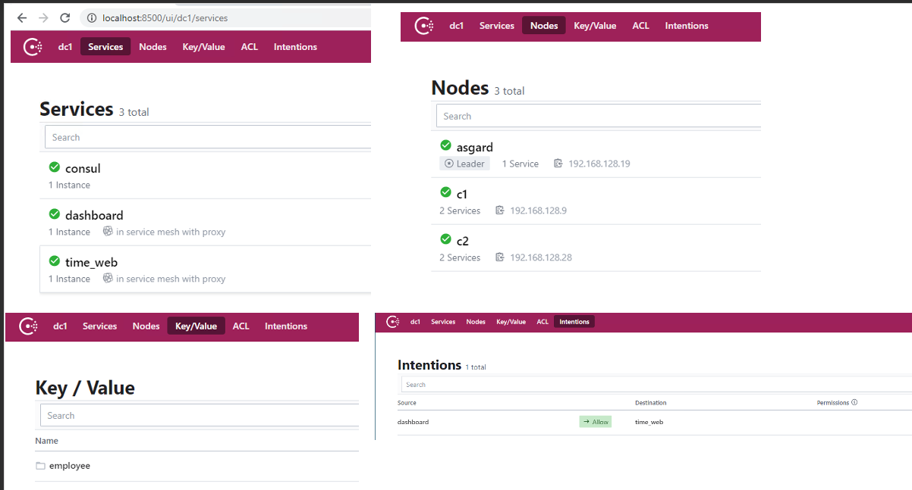

# Consul_Multi_Node_Cluster
Consul Multi Node service mesh using Macbook, Raspberry Pi and Windows Laptop

I wanted to learn Consul cluster bringup, service mesh and KV store. Since we are stuck @ home, ended up brining up a Consul cluster with nodes scatterred in my home LAN/WLAN.

Windows PC --> Consul Server  
MBP --> Consul Client 1. Hosted DownStream Service  
Raspi --> Consul Client 2. Hosted UpStream Service  

Sidecar Proxy : Consul built-in   
Consul Version: Consul v1.9.0   

# IP Topology

Windows PC --> 192.168.128.19  
MBP --> 192.168.128.9   
Raspi --> 192.168.128.28   

Credits : Thanks to [Consul tutorials](https://learn.hashicorp.com/consul) and to many people who posted articles on Consul bringup. :+1:

# Steps

## Windows

#### Start up Consul Server
> consul agent -dev -server -ui -bootstrap-expect 1 -bind 192.168.128.19 -node asgard -data-dir=<path> -config-dir=<path>   
  
config-dir was empty and gave a tmp path for data-dir. In data-dir consul will store its own data  

## MBP

#### Start up Consul Client

> consul agent  -node=c3 -bind=192.168.128.9 -data-dir=<path> -config-dir=<path>   
  
Config-dir loaded with a SVC definition with Sidecar Proxy configuration. File_Name:dboard.json   

#### Join to Cluster

> consul join 192.168.128.19

#### Sample Downstream Service

> Curl 

#### Attach Sidecar Proxy

> consul connect proxy -sidecar-for dashboard

## Raspi

#### Start up Consul Client

> consul agent  -node=c2 -bind=192.168.128.28 -data-dir=<path> -config-dir=<path>   
  
Config-dir loaded with a SVC definition with Sidecar Proxy configuration. File_Name:time_svc_web.json   

#### Join to Cluster

> consul join 192.168.128.19

#### Sample UpStream Service

A tiny pyton Flask app was written to return time. File_Name:tell_me_time.py   

#### Attach Sidecar Proxy

>  consul connect proxy -sidecar-for time_web

#### Enable intention to connect both service

> consul intention create dashboard time_web

# Debugs

Consul runs DNS in port 8600 and UI in Port 8500   

## consul members

> $> consul members  
Node    Address              Status  Type    Build  Protocol  DC   Segment  
asgard  192.168.128.19:8301  alive   server  1.9.0  2         dc1  <all>
c1      192.168.128.9:8301   alive   client  1.9.0  2         dc1  <default>
c2      192.168.128.28:8301  alive   client  1.9.0  2         dc1  <default>

## List registered Services

> $> consul catalog services
consul
dashboard
dashboard-sidecar-proxy
time_web
time_web-sidecar-proxy

## Use Dig to find Services 

> $> dig @127.0.0.1 -p 8600  web.service.consul

; <<>> DiG 9.10.6 <<>> @127.0.0.1 -p 8600 web.service.consul
; (1 server found)
;; global options: +cmd
;; Got answer:
;; ->>HEADER<<- opcode: QUERY, status: NXDOMAIN, id: 34616
;; flags: qr aa rd; QUERY: 1, ANSWER: 0, AUTHORITY: 1, ADDITIONAL: 1
;; WARNING: recursion requested but not available

;; OPT PSEUDOSECTION:
; EDNS: version: 0, flags:; udp: 4096
;; QUESTION SECTION:
;web.service.consul.		IN	A

;; AUTHORITY SECTION:
consul.			0	IN	SOA	ns.consul. hostmaster.consul. 1607736748 3600 600 86400 0

;; Query time: 7 msec
;; SERVER: 127.0.0.1#8600(127.0.0.1)
;; WHEN: Fri Dec 11 17:32:28 PST 2020
;; MSG SIZE  rcvd: 97

## Ping to Check Services 

DNS might not resolve. Link to enable [DNS forwarding:] (https://learn.hashicorp.com/tutorials/consul/dns-forwarding)

> ping time_web.service.consul
PING time_web.service.consul (192.168.128.28): 56 data bytes
64 bytes from 192.168.128.28: icmp_seq=0 ttl=64 time=6.138 ms
--- time_web.service.consul ping statistics ---
2 packets transmitted, 1 packets received, 50.0% packet loss
round-trip min/avg/max/stddev = 6.138/6.138/6.138/0.000 ms

## Access Service hosted on Raspi from MBP through Service Mesh

> curl http://localhost:9001
time is 1607635269.896242

## Use Consul KV Store

> consul kv put employee/employee1/name Jane
Success! Data written to: employee/employee1/name

> consul kv get employee/employee1/name
Jane

## Leave Consul Cluster Gracefully
> consul leave
Graceful leave complete 

