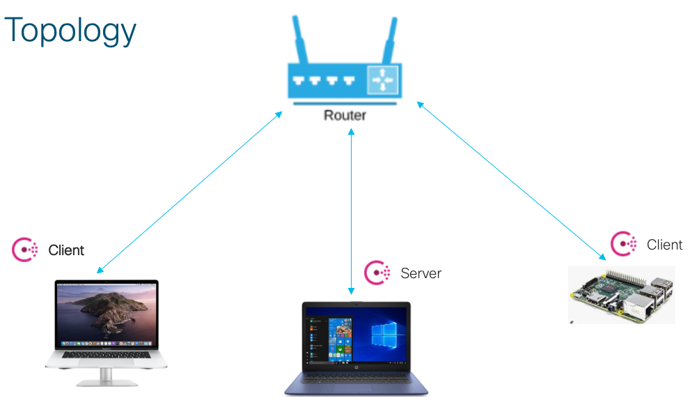

# Consul_Multi_Node_Cluster
Consul Multi Node service mesh using Macbook, Raspberry Pi and Windows Laptop

I wanted to learn Consul cluster bringup, service mesh and KV store. Since we are stuck @ home, ended up brining up a Consul cluster with nodes scatterred in my home LAN/WLAN.

Windows PC --> Consul Server  
MBP --> Consul Client . Hosted DownStream Service  
Raspi --> Consul Client Hosted UpStream Service  

Sidecar Proxy : Consul built-in

#IP 

Windows PC --> 192.168.128.19  
MBP --> 192.168.128.9   
Raspi --> 192.168.128.28   

Credits : Thanks to Consul website (https://www.consul.io/docs/intro) and to many people who posted articles on Consul. +1:

# Steps

## Windows

#### Start up Consul Server
consul agent -dev -server -ui -bootstrap-expect 1 -bind 192.168.128.19 -node asgard -data-dir=<path> -config-dir=<path>   
  
config-dir was empty and gave a tmp path for data-dir. In data-dir consul will store its own data  

## MBP

#### Start up Consul Client

consul agent  -node=c3 -bind=192.168.128.9 -data-dir=<path> -config-dir=<path>   
Config-dir loaded with a SVC definition with Sidecar Proxy configuration. FileName:dboard.json   

#### Join to Cluster

consul join 192.168.128.1

#### Sample Downstream Service

Used Curl 

## Raspi

#### Start up Consul Client

consul agent  -node=c2 -bind=192.168.128.28 -data-dir=<path> -config-dir=<path>   
Config-dir loaded with a SVC definition with Sidecar Proxy configuration. FileName:time_svc_web.json   

#### Join to Cluster

consul join 192.168.128.1

#### Sample UpStream Service

A tiny pyton Flask app was written to return time. FileName:tell_me_time.py

'''

$> consul members  
Node    Address              Status  Type    Build  Protocol  DC   Segment  
asgard  192.168.128.19:8301  alive   server  1.9.0  2         dc1  <all>  
c2      192.168.128.28:8301  alive   client  1.9.0  2         dc1  <default>  
c3      192.168.128.9:8301   alive   client  1.9.0  2         dc1  <default>  

'''

consul kv get name

consul kv get name

